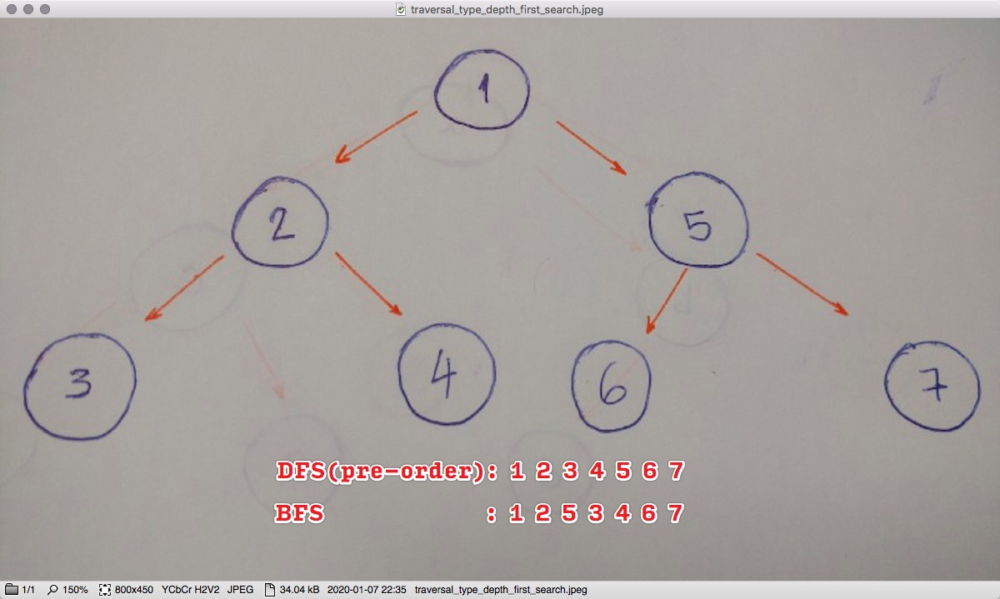

### Terminology summary <small>([*ref*](https://www.freecodecamp.org/news/all-you-need-to-know-about-tree-data-structures-bceacb85490c/))</small>
- *Root* is the topmost `node` of the tree
- *Edge* is the link between two `nodes`
- *Child* is a `node` that has a `parent node`
- *Parent* is a `node` that has an `edge` to a `child node`
- *Leaf* is a `node` that does not have a child node in the `tree`
- *Height* is the length of the longest path to a `leaf`
- *Depth* is the length of the path to its `root`

### Types of *search*
- *Depth-First* Search <small>(aka. DFS)</small>
    - It is an algorithm for *traversing* or *searching* <u>tree data structure</u>
        > 1) one starts at the root & explores AFAP along each branch before backtracking 
        > 2) the process is the *same* as the <u>pre-order traversal</u>
    - Types of *tree traversals*
        - `pre-order`
            > TOP -> LEFT -> LEFT .. THE_REST -> RIGHT -> LEFT .. THE_REST

        - `in-order`
            > BOTTOM -> LEFT|MIDDLE|RIGHT -> .. TOP .. -> LEFT|MIDDLE|RIGHT

        - `post-order`
            > BOTTOM -> LEFT|RIGHT|MIDDLE -> LEFT|MIDDLE|RIGHT -> .. TOP

- *Breadth-First* Search <small>(aka. BFS)</small>
    - It is an algorithm for *traversing* or *searching* <u>tree data structure</u>
        > <q>it starts at the tree root & explores explores the neighbor nodes first, before
        moving to the next level neighbours</q>
        >> 
